# Ontoverse Architecture Documentation

This document provides comprehensive diagrams to help understand the Ontoverse application architecture, data flow, and component relationships.

## Table of Contents
1. [High-Level Architecture](#1-high-level-architecture)
2. [Application Layer Architecture](#2-application-layer-architecture)
3. [Component Hierarchy](#3-component-hierarchy)
4. [Data Flow Diagram](#4-data-flow-diagram)
5. [State Management Architecture](#5-state-management-architecture)
6. [Neo4j Database Integration](#6-neo4j-database-integration)
7. [Graph Visualization Pipeline](#7-graph-visualization-pipeline)
8. [User Interaction Flow](#8-user-interaction-flow)
9. [File Structure Organization](#9-file-structure-organization)

---

## 1. High-Level Architecture

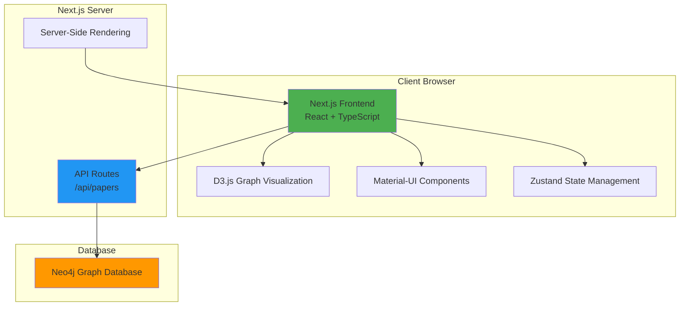

**Description**: Ontoverse is a full-stack Next.js application that combines frontend and backend functionality. The client uses React with TypeScript for UI, D3.js for graph visualization, Material-UI for design components, and Zustand for state management. The backend API routes communicate with a Neo4j graph database to fetch and process paper relationships.

---

## 2. Application Layer Architecture

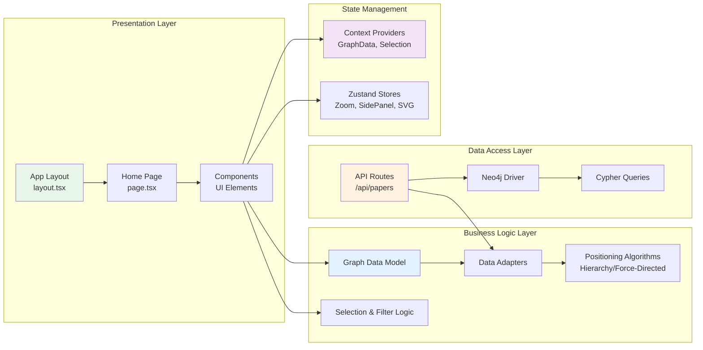

**Description**: The application follows a layered architecture:
- **Presentation**: Next.js pages and React components for UI
- **Business Logic**: Data models, transformation, and positioning algorithms
- **Data Access**: API routes and Neo4j database communication
- **State Management**: Distributed between Context API and Zustand stores

---

## 3. Component Hierarchy

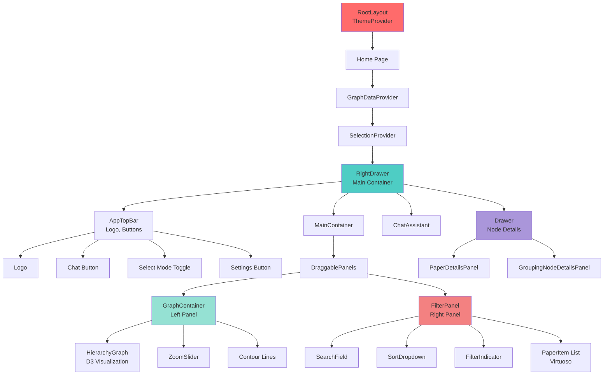

**Description**: The component tree starts with the root layout applying global theme, then flows through context providers (GraphData, Selection) before reaching the main RightDrawer container. This container manages the top bar, draggable panels (graph + filter), and detail drawers.

---

## 4. Data Flow Diagram

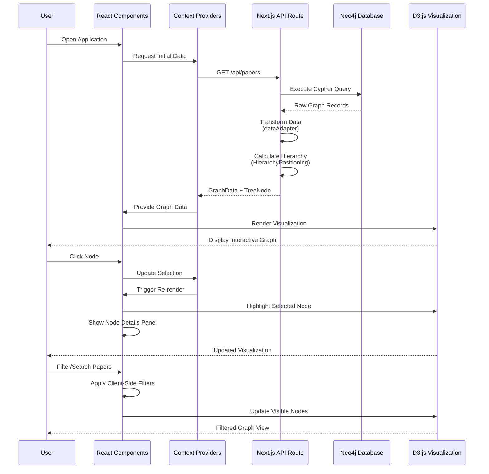

**Description**: The data flows from the Neo4j database through API routes where it's transformed and enriched, then stored in React Context and consumed by components. User interactions update local state and trigger re-renders without server roundtrips.

---

## 5. State Management Architecture

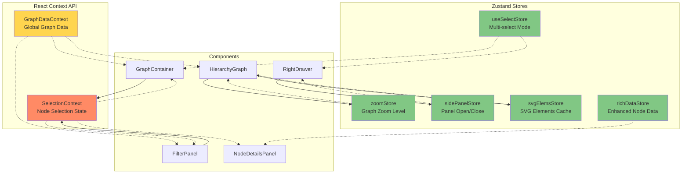

**Description**: State management is divided between:
- **Context API**: For global, infrequently-changing data (graph data, selection state)
- **Zustand Stores**: For frequently-updated, localized state (zoom, panel visibility, cached SVG elements)

---

## 6. Neo4j Database Integration

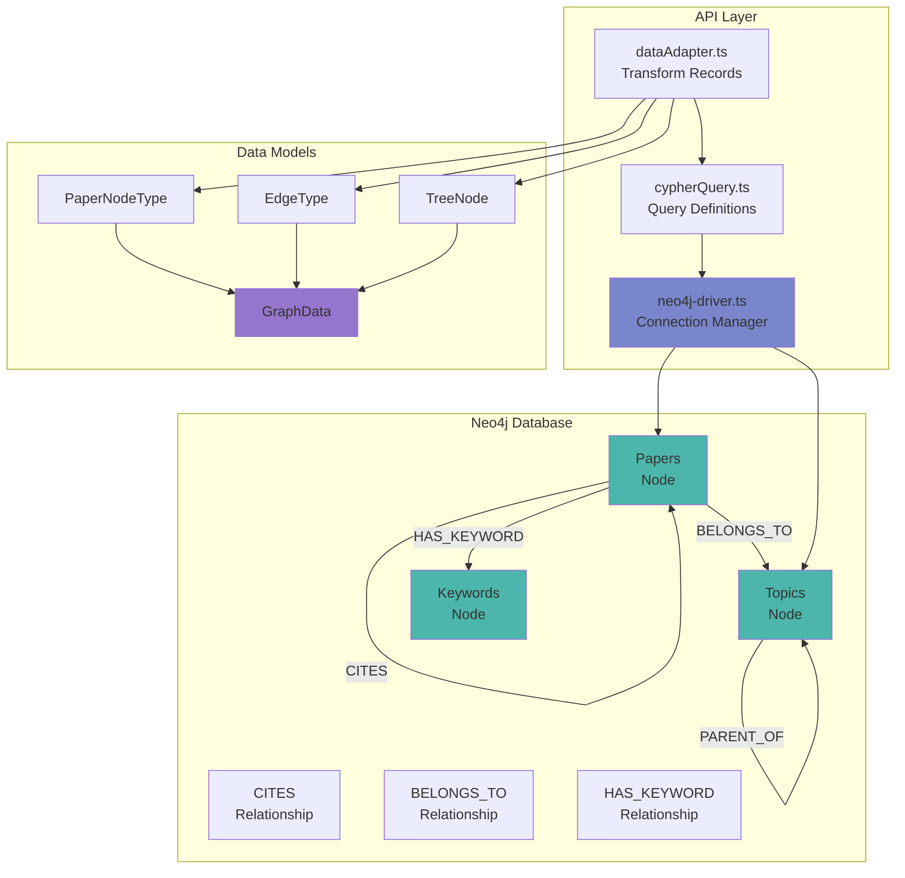

**Description**: The application connects to Neo4j using the official driver. Cypher queries fetch papers, topics, and relationships. Data is transformed from Neo4j's format into TypeScript models (PaperNodeType, EdgeType, TreeNode) and aggregated into a GraphData structure.

---

## 7. Graph Visualization Pipeline

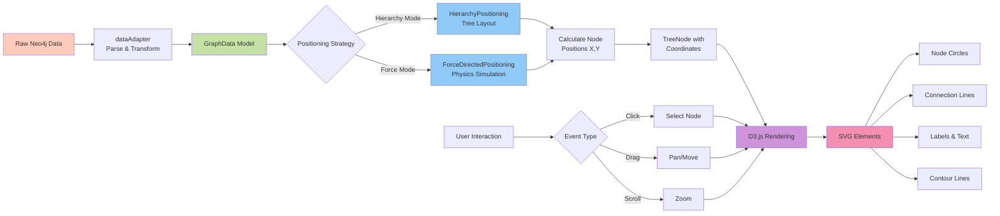

**Description**: Graph data flows through positioning algorithms (hierarchy or force-directed) to calculate coordinates, then D3.js renders SVG elements. User interactions (click, drag, zoom) are captured and feed back into the rendering pipeline for dynamic updates.

---

## 8. User Interaction Flow

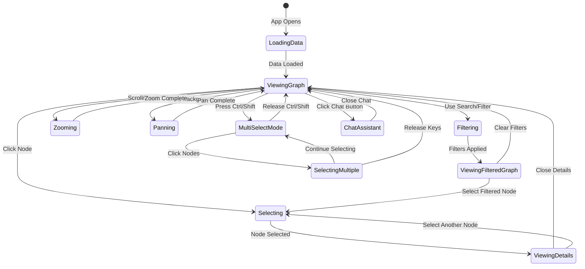

**Description**: Users can navigate between different interaction modes: viewing the graph, selecting nodes to see details, applying filters to narrow results, zooming/panning for navigation, and entering multi-select mode with keyboard modifiers. The chat assistant is accessible from any state.

---

## 9. File Structure Organization

```mermaid
graph TD
    A[odsp-ontoverse/] --> B[app/<br/>Next.js App Router]
    A --> C[components/<br/>React Components]
    A --> D[lib/<br/>Business Logic]
    A --> E[model/<br/>Data Models & Stores]
    A --> F[public/<br/>Static Assets]
    
    B --> B1[layout.tsx<br/>Root Layout]
    B --> B2[page.tsx<br/>Home Page]
    B --> B3[api/papers/<br/>API Endpoints]
    
    C --> C1[graphs/<br/>Visualization]
    C --> C2[filter/<br/>Search & Filter]
    C --> C3[layout/<br/>Layout Components]
    C --> C4[NodeDetailsPanels/<br/>Detail Views]
    C --> C5[ChatAssistant.tsx<br/>AI Chat UI]
    
    C1 --> C1A[GraphContainer.tsx]
    C1 --> C1B[hierarchy/HierarchyGraph.ts]
    C1 --> C1C[GraphConfig.ts]
    
    C2 --> C2A[FilterPanel.tsx]
    C2 --> C2B[SearchField.tsx]
    C2 --> C2C[PaperItem.tsx]
    
    D --> D1[neo4j/<br/>Database Layer]
    D --> D2[papers/model/<br/>Data Models]
    D --> D3[state/<br/>Context Providers]
    D --> D4[utils/<br/>Helper Functions]
    
    D1 --> D1A[neo4j-driver.ts]
    D1 --> D1B[neo4j-config.ts]
    
    D2 --> D2A[GraphDataModel.ts]
    D2 --> D2B[dataAdapter.ts]
    D2 --> D2C[HierarchyPositioning.ts]
    D2 --> D2D[cypherQuery.ts]
    
    E --> E1[store/<br/>Zustand Stores]
    E --> E2[GraphDataModel.ts]
    
    E1 --> E1A[useSelection.ts]
    E1 --> E1B[zoomStore.ts]
    E1 --> E1C[sidePanelStore.ts]
    
    style A fill:#E1F5FE
    style B fill:#FFF9C4
    style C fill:#F3E5F5
    style D fill:#E8F5E9
    style E fill:#FFE0B2
```

**Description**: The codebase follows Next.js 14 App Router conventions with clear separation of concerns:
- **app/**: Next.js pages and API routes
- **components/**: Reusable React UI components organized by feature
- **lib/**: Business logic, data access, and utilities
- **model/**: Data models and Zustand state stores
- **public/**: Static files and runtime configuration

---

## Key Technologies Summary

| Layer | Technology | Purpose |
|-------|-----------|---------|
| **Frontend** | Next.js 14 | Full-stack React framework with SSR |
| | React 18 | UI component library |
| | TypeScript | Type-safe development |
| | Material-UI (MUI) | Component library & design system |
| | D3.js | Graph visualization and SVG manipulation |
| **State Management** | React Context | Global state (graph data, selection) |
| | Zustand | Local state (zoom, panels, cache) |
| **Backend** | Next.js API Routes | RESTful API endpoints |
| | Neo4j Driver | Database connectivity |
| **Database** | Neo4j | Graph database for papers & relationships |
| **Styling** | Emotion | CSS-in-JS styling solution |
| | Styled Components | Component-level styling |

---

## Data Models Overview

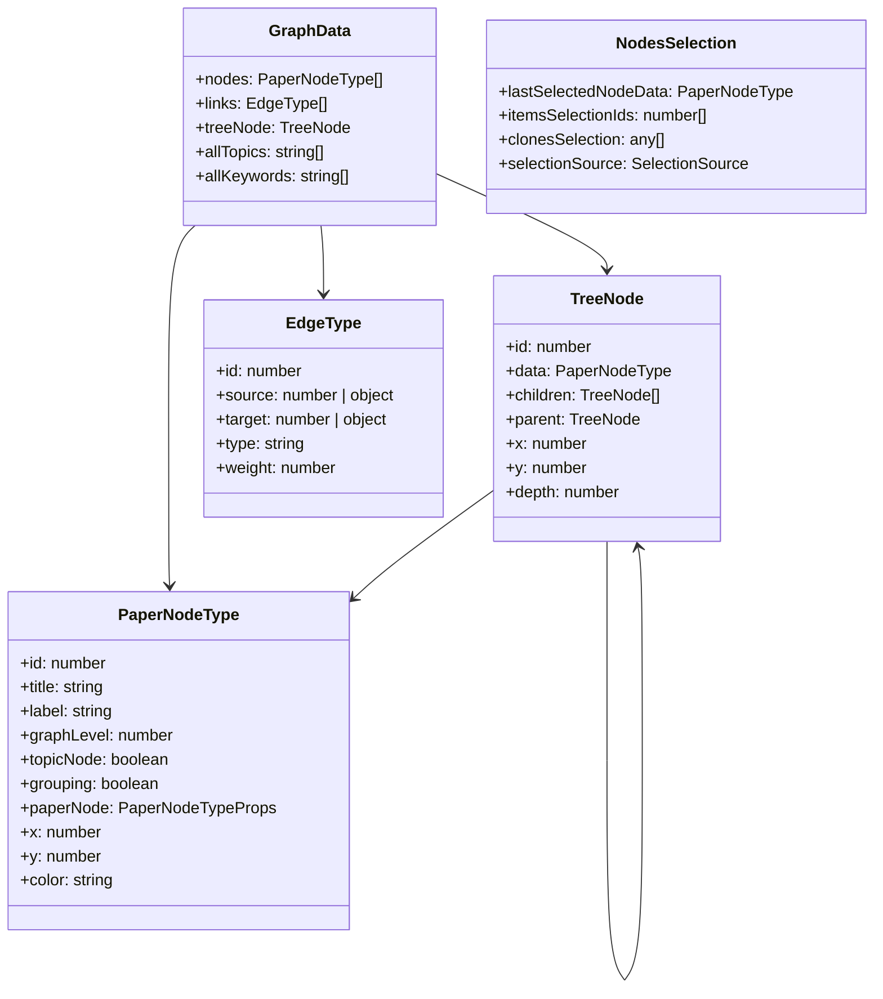

---

## Deployment Architecture

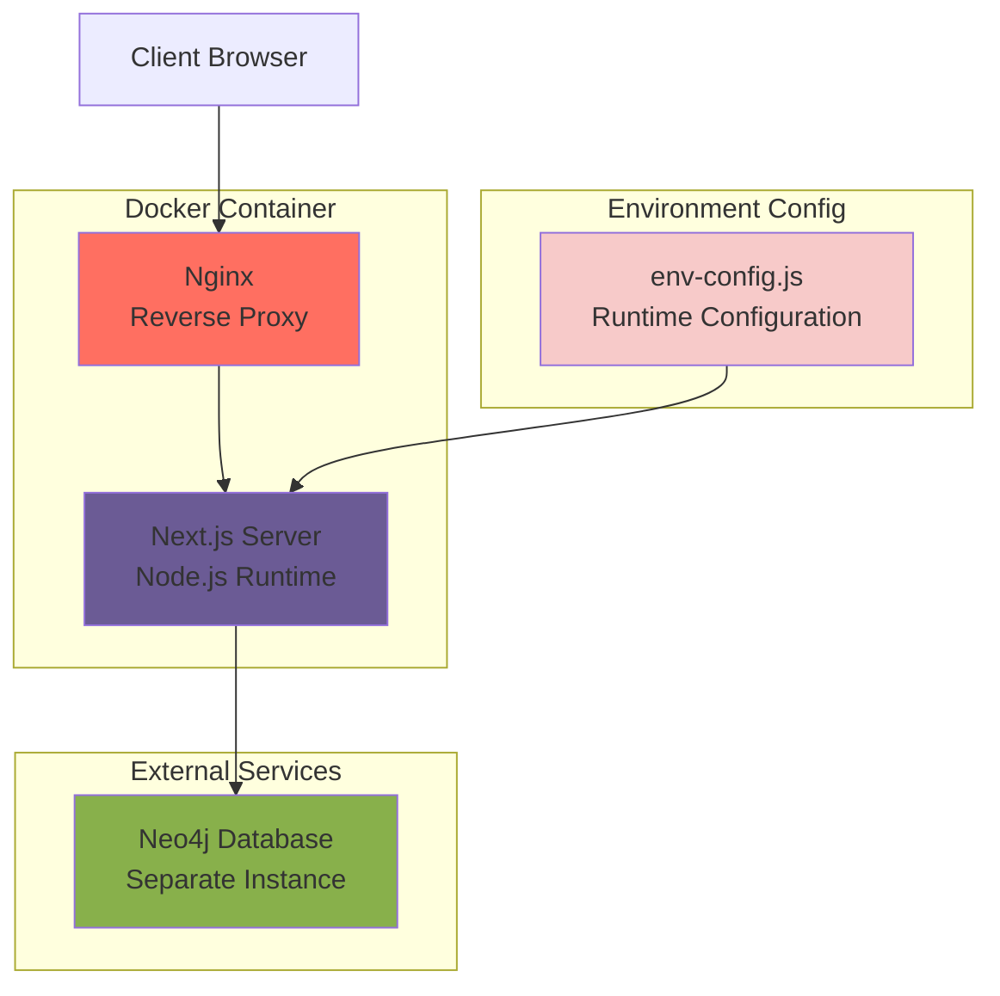

**Description**: The application can be deployed as a Docker container with Nginx serving as a reverse proxy. Next.js runs in production mode, connecting to an external Neo4j instance. Runtime configuration is injected via `env-config.js` for flexibility across environments.

---

## Contributing

When contributing to Ontoverse, refer to these diagrams to understand:
- Where new features should be implemented
- How data flows through the system
- Which state management solution to use
- How components interact with each other

For questions or clarifications, please refer to the main [README.md](README.md) and [CONTRIBUTING.md](CONTRIBUTING.md).

---

*Generated on January 9, 2026*
